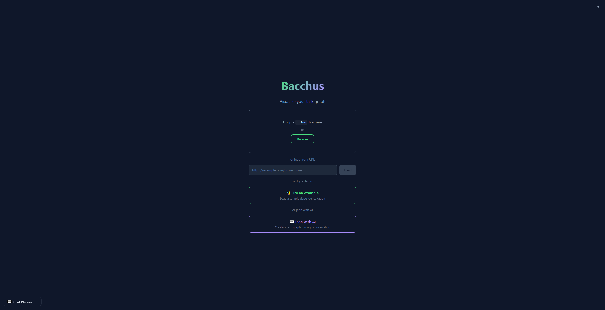
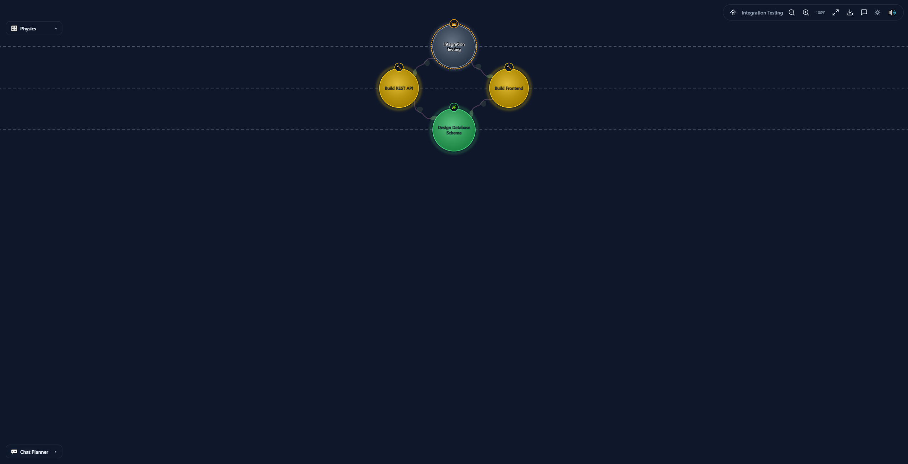
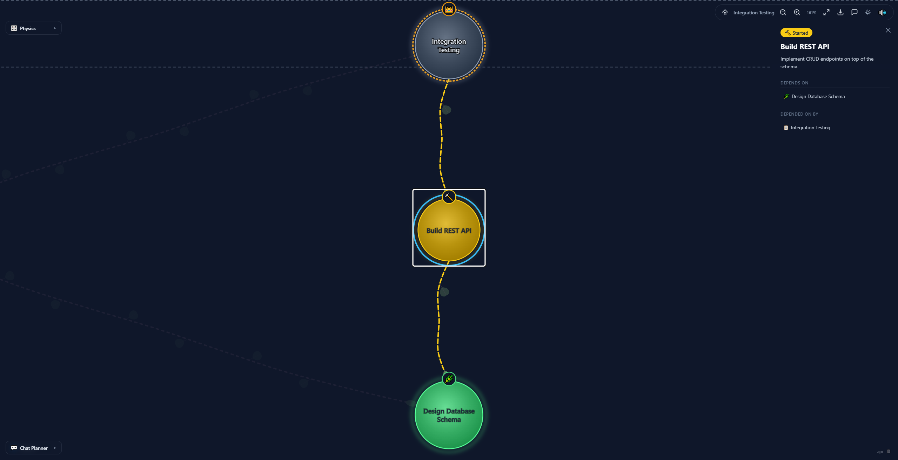
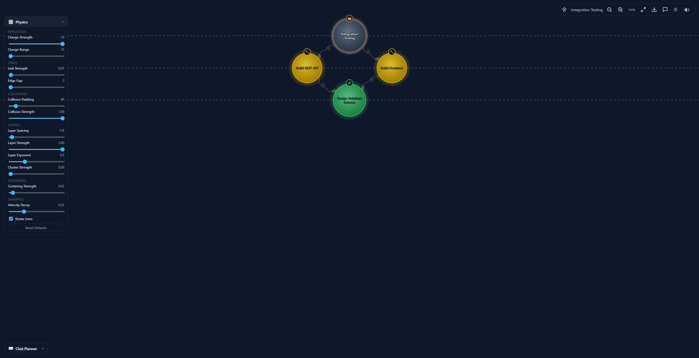
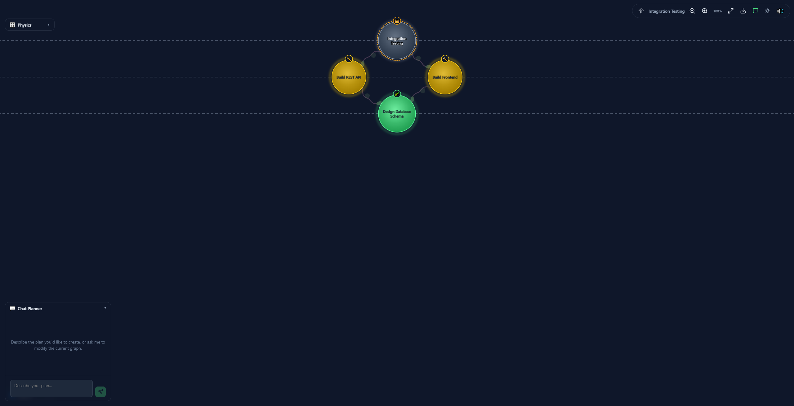

# Bacchus User Guide

A visual walkthrough of Bacchus — from landing to graph exploration and AI-powered planning.

---

## 1. Landing Screen

When you first open Bacchus, you'll see the landing screen with multiple ways to get started:

**Getting started — choose your path:**

| Action            | How                                                                  |
| ----------------- | -------------------------------------------------------------------- |
| **Drop a file**   | Drag a `.vine` file onto the drop zone                               |
| **Load from URL** | Paste a URL to a hosted `.vine` file and click **Load**              |
| **Try a demo**    | Click **✨ Try an example** to load a sample diamond graph           |
| **Plan with AI**  | Click **💬 Plan with AI** or the **Chat Planner** pill (bottom-left) |

> **Tip:** The 💬 Chat Planner accordion pill is always visible at the bottom-left corner of both the landing screen and the graph view.

---

## 2. Loading a Graph

After loading a `.vine` file (via drop, URL, or demo), Bacchus transitions to the **Graph View** with an animated entry sequence:

**What you see:**

- **Task nodes** — colored circles representing each task. Colors reflect status: 💎 complete (emerald), 🪙 started (gold), 🔍 reviewing (amber), 🪩 planning (purple), ⚪ not started (silver), 🔴 blocked (crimson)
- **Dependency edges** — curved arrows showing task relationships (arrow points from dependent → dependency)
- **Status emoji badges** — small emoji icons on each node (🌿 complete, 🔨 started, � reviewing, �📋 not started, etc.)
- **Strata lines** — dashed horizontal lines grouping tasks by depth level
- **Toolbar** (top-right) — home, zoom controls, fit-to-view, SVG export, chat toggle, theme, and sound

**Left-side panels** (collapsed by default):

- **🎛️ Physics** — tune the force-directed layout
- **💬 Chat Planner** — AI-powered graph editing
- **ℹ️ Legend** — status color reference

---

## 3. Focusing a Task

Click any node to **focus** it. The camera smoothly zooms in, framing the selected task along with its parent and direct dependencies. A detail sidebar slides in from the right:

**Sidebar details:**

- **Status badge** — current task status with emoji
- **Task name** — the task's short name
- **Description** — full task description
- **Depends on** — clickable list of upstream dependencies
- **Depended on by** — clickable list of downstream dependants
- **Attachments** — if the task has attachments, a section showing each attachment with its class icon (📎 artifact, 📖 guidance, 📁 file), MIME type badge, and clickable URI link
- **Task ID** — with a copy-to-clipboard button

> **Breadcrumbs:** Landing → Load graph → Click node → Sidebar opens

Click the **✕** button or press **Escape** to close the sidebar and return to the full graph view.

---

## 4. Physics Controls

Expand the **🎛️ Physics** accordion to fine-tune the force-directed layout in real time:

**Slider groups:**

| Group          | Parameters                                                      |
| -------------- | --------------------------------------------------------------- |
| **Repulsion**  | Charge Strength, Charge Range                                   |
| **Links**      | Link Strength, Edge Gap                                         |
| **Collisions** | Collision Padding, Collision Strength                           |
| **Layout**     | Layer Spacing, Layer Strength, Layer Exponent, Cluster Strength |
| **Centering**  | Centering Strength                                              |
| **Damping**    | Velocity Decay                                                  |

- **Strata Lines** checkbox — toggle the dashed depth-level lines
- **Reset Defaults** — restore all sliders to their default values

> **Breadcrumbs:** Graph View → Click 🎛️ Physics pill → Adjust sliders

---

## 5. Chat Planner

Expand the **💬 Chat Planner** accordion to create or modify task graphs through natural conversation with AI:

**How it works:**

1. **API Key** — If no key is configured, you'll be prompted to enter your Anthropic API key (stored locally in your browser, never sent to our servers)
2. **Describe your plan** — Type a natural language description of the task graph you want to create or modify
3. **AI responds** — The assistant uses structured tool calls to add tasks, set statuses, and wire dependencies
4. **Tool feedback cards** — Each graph mutation shows a rich detail card confirming what changed
5. **Live graph updates** — The graph view updates in real time as the AI makes changes

**Example prompts:**

- _"Create a web app project with frontend, backend, and database tasks"_
- _"Mark the Design task as complete and start the Implementation task"_
- _"Add a testing task that depends on both frontend and backend"_

> **Breadcrumbs:** Graph View → Click 💬 Chat Planner pill → Type a message → Watch the graph update

**Session persistence:** Chat history is saved per graph in your browser. Navigate away and back — your conversation resumes where you left off.

---

## Keyboard Shortcuts

| Key                           | Action                    |
| ----------------------------- | ------------------------- |
| **Click** node                | Focus task + open sidebar |
| **Escape**                    | Close sidebar / unfocus   |
| **Scroll wheel**              | Zoom in/out               |
| **Click + drag** (background) | Pan the view              |
| **Enter**                     | Send chat message         |
| **Shift+Enter**               | Insert newline in chat    |

---

## Tips

- **All panels use the same accordion pattern** — click any pill to expand/collapse
- **Sound effects** can be toggled with the 🔊 button in the toolbar
- **Light/dark theme** — click the ⚙️ theme toggle (top-right on landing, toolbar on graph view)
- **SVG export** — click the download button in the toolbar to save the graph as an SVG file
- **URL routing** — each graph gets a shareable URL like `/bacchus/{taskId}`
